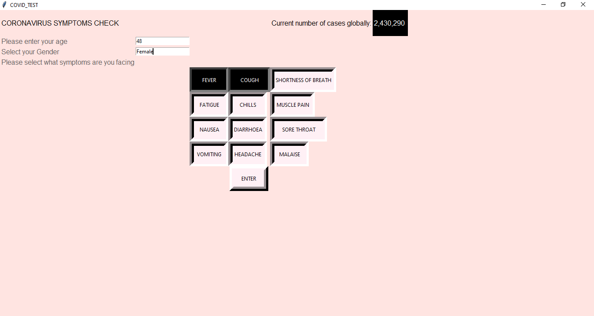
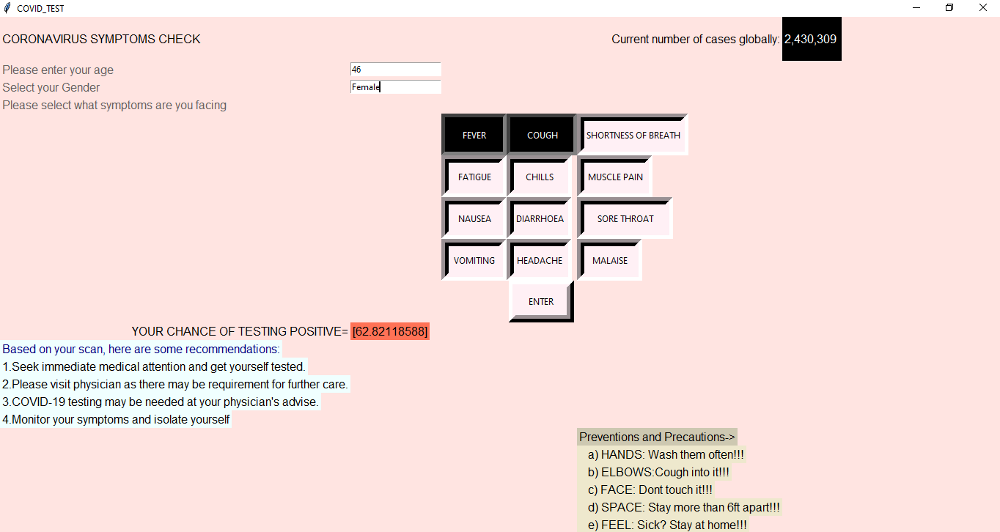

# Covid-19Detector App

Coronavirus disease (COVID-19) is an infectious disease caused by a new virus.
The disease causes respiratory illness (like the flu) with symptoms such as a cough, fever, and in more severe cases, difficulty breathing.

We have a designed an application using **MACHINE LEARNING** that predicts the probability of a person testing positive for COVID-19 disease based on the symptoms. However the World Health Organisation (WHO) has released statistcs that 45-50% of the patients testing positive have mild or no symptoms at all.
This app can only be used for the remaining cases in which symptoms are present.

The app is build on Python progrraming language and the UI/UX is developed on the tkinter platform. We have used the **Logistic regression algorithm** in machine learning so as to increase the accuracy of output. The data for patients testing positive was provided by WHO on kaggle.

Here are some Screenshots of the app.

**Sources**
1. https://www.kaggle.com/sudalairajkumar/novel-corona-virus-2019-dataset
2. https://www.who.int/emergencies/diseases/novel-coronavirus-2019

**Team**
1. https://github.com/Nimish-Jain
2. https://github.com/arpit4120
3. https://github.com/kirtikajain
4. https://github.com/architgpt2802
